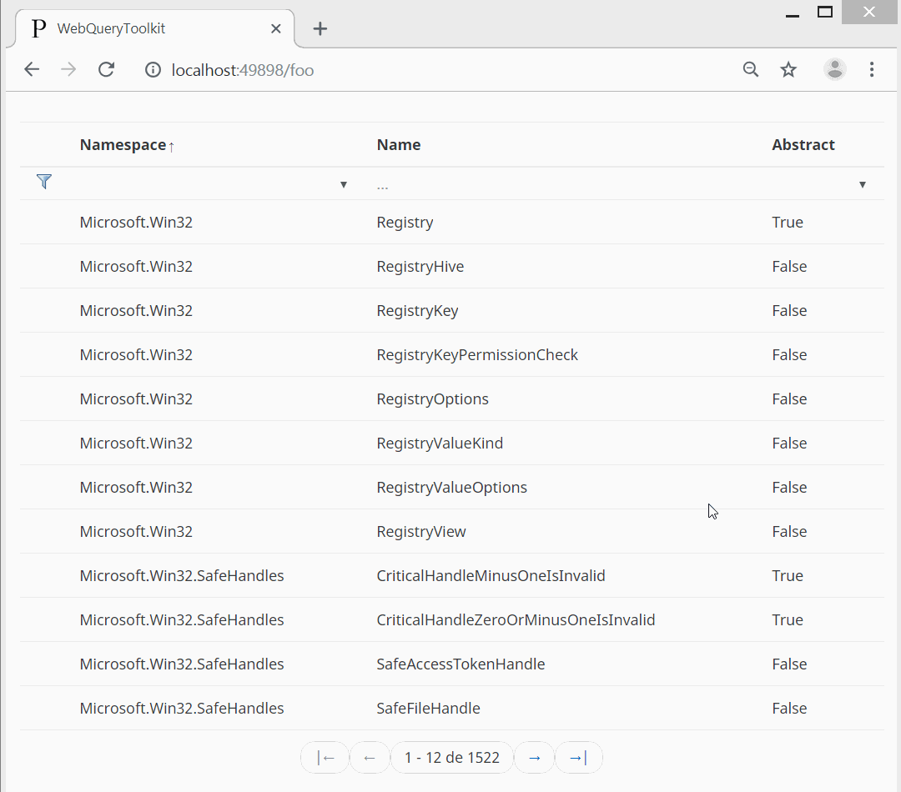

[WebQueryToolkit]
=================
WebQueryToolkit is a mini framework that aids in the development of paginated web pages. It includes:

- [An API](#api) of three classes
- [UI controls](#ui-controls) for [XCST]
- Extension elements and attributes for declarative configuration

WebQueryToolkit is meant to be used as a starting kit. It is therefore intentionally small and there's no binary distribution. Use the source and tweak as necessary.

## API

```text
WebQueryResults -> WebQueryParameters -> WebQuerySettings
```

### WebQuerySettings

Defines default values and configuration of query parameters. e.g.:

```csharp
var querySettings = new WebQuerySettings(
   orderBy: "Id DESC",
   orderByParameterAllowed: true,
   orderByAllowedProperties: new[] { "Id", "Price" },
   skipParameterAllowed: true,
   top: 24
);
```

All the parameters of the WebQuerySettings constructor are optional. Everything is *turned off* by default. In the above example, the orderby and skip parameters are allowed, which means the client can specify them in the URL, but the top parameter is not.

### WebQueryParameters

Represents the query parameters to be used by your application. The values may come from settings or from the query string. e.g.:

```csharp
WebQueryParameters queryParams = null;

if (!Request.TryCreateWebQueryParameters(querySettings, out queryParams)) {
   Response.StatusCode = 404;
   return;
}
```

TryCreateWebQueryParameters is an extension method, which is a shortcut for:

```csharp
WebQueryParameters queryParams = null;

if (!WebQueryParameters.TryCreate(Request.Url, Request.QueryString, querySettings, out queryParams, out _ /*errorMessage*/) {
   Response.StatusCode = 404;
   return;
}
```

WebQueryParameters has three main properties: OrderBy, Skip and Top. In the above example, `queryParams.Top` is `24`.

Now you can use queryParams to query your database:

```csharp
var set = db.Table<Product>();

int totalCount = set.Count();

IEnumerable<Product> results = set
   .OrderBy(queryParams.OrderBy)
   .Skip(queryParams.Skip)
   .Take(queryParams.Top.Value)
   .AsEnumerable();
```

Use the ORM of your preference. The above example uses [DbExtensions].

### WebQueryResults

Wraps an IEnumerable&lt;TResult> to include pagination information. e.g.:

```csharp
var queryResults = new WebQueryResults<Product>(results, totalCount /* optional */, queryParams);
```

WebQueryResults itself implements IEnumerable, so you can enumerate as usual:

```csharp
foreach (Product item in queryResults) {
   
}
```

WebQueryResults has properties like TotalCount, QueryParameters, NumberOfPages and CurrentPage.

## UI Controls

WebQueryToolkit implements three UI controls: [pagination](#pagination-control), [pager](#pager-control) and [table](#table-control). These are written in [XCST]. Porting to other template engines should be trivial.

Use `c:use-package` to import the controls:

```xml
<c:use-package name='WebQueryToolkit.WebQueryPackage'/>
```

### Pagination control

Renders a [Bootstrap pagination](http://getbootstrap.com/docs/4.1/components/pagination/) component:

```xml
<c:call-template name='pagination'>
   <c:with-param name='queryResults' value='queryResults'/>
</c:call-template>
```

<details>
<summary>Outputs:</summary>

```html
<ul class="pagination">
  <li class="page-item page-prev disabled">
    <span class="page-link">← Anterior</span>
  </li>
  <li class="page-item active">
    <span class="page-link">1</span>
  </li>
  <li class="page-item">
    <a class="page-link" href="/foo?$skip=24">2</a>
  </li>
  <li class="page-item">
    <a class="page-link" href="/foo?$skip=48">3</a>
  </li>
  <li class="page-item page-next">
    <a class="page-link" href="/foo?$skip=24">Siguiente →</a>
  </li>
</ul>
```
</details>

#### Parameters

Name | Default | Type | Required
---- | ------- | ---- | --------
queryResults | | WebQueryToolkit.WebQueryResults | yes
maxPagesToDisplay | 12 | int | no
alwaysDisplayPreviousNext | true | bool | no
alwaysDisplayFirstLast | true | bool | no
urlPath | | string | no

### Pager control

Renders a [Bootstrap pager](https://getbootstrap.com/docs/3.3/components/#pagination-pager) component (which was dropped in v4, so it needs a little CSS):

```xml
<c:call-template name='pager'>
   <c:with-param name='queryResults' value='queryResults'/>
</c:call-template>
```

<details>
<summary>Outputs:</summary>

```html
<ul class="pager">
  <li class="disabled">
    <span title="Primera">|←</span>
  </li>
  <li class="disabled">
    <span title="Anterior">←</span>
  </li>
  <li>
    <span>1 - 24 de 67</span>
  </li>
  <li>
    <a href="/foo?$skip=24" title="Siguiente">→</a>
  </li>
  <li>
    <a href="/foo?$skip=48" title="Última">→|</a>
  </li>
</ul>
```
</details>

#### Parameters

Name | Default | Type | Required
---- | ------- | ---- | --------
queryResults | | WebQueryToolkit.WebQueryResults | yes
urlPath | | string | no

### Table control

Renders an HTML table using the type's metadata. It supports filtering, sorting and paging.

<details>
<summary>Preview:</summary>

</details>

For example, using `c:type` (although you can also do it in plain C# using data annotations):

```xml
<c:type name='TypeEntry'>
   <c:member name='Name' as='string'/>
   <c:member name='Namespace' as='string' order='1'/>
   <c:member name='IsAbstract' as='bool' display-name='Abstract'/>
</c:type>
```

```csharp
var querySettings = new WebQuerySettings(
   filterAllowedProperties: new[] { nameof(TypeEntry.Namespace), nameof(TypeEntry.Name), nameof(TypeEntry.IsAbstract) },
   orderBy: nameof(TypeEntry.Namespace),
   orderByParameterAllowed: true,
   skipParameterAllowed: true,
   top: 12
);

WebQueryParameters queryParams = null;
var filters = new TypeEntry();

if (!(Request.TryCreateWebQueryParameters(querySettings, out queryParams)
   && await TryUpdateModelAsync(filters, valueProvider: new QueryStringValueProvider(BindingSource.Query, HttpContext.Request.Query, CultureInfo.InvariantCulture)))) {

   Response.StatusCode = 404;
   return;
}

var set = typeof(object).Assembly
   .GetTypes()
   .Where(t => !t.IsNested && t.IsPublic);
            
var filtersOptions = new Dictionary<string, IEnumerable<SelectListItem>> {
   {
      nameof(TypeEntry.Namespace),
      new SelectList(set
         .Select(t => t.Namespace)
         .Distinct(),
         filters.Namespace
      )
   }
};
            
var filteredSet = set;
            
if (filters.Namespace != null) {
   filteredSet = filteredSet.Where(t => t.Namespace == filters.Namespace);
}
            
if (filters.Name != null) {
   filteredSet = filteredSet.Where(t => t.Name.StartsWith(filters.Name));
}
            
if (filters.IsAbstract != null) {
   filteredSet = filteredSet.Where(t => t.IsAbstract == filters.IsAbstract);
}
            
var queryResults = new WebQueryResults<TypeEntry>(
   // OrderBy(string) is possible with System.Linq.Dynamic
   filteredSet.OrderBy($"{queryParams.OrderBy}, {nameof(Type.Name)}")
      .Skip(queryParams.Skip)
      .Take(queryParams.Top.Value)
      .Select(t => new TypeEntry { Name = t.Name, Namespace = t.Namespace, IsAbstract = t.IsAbstract }),
   filteredSet.Count(),
   queryParams
);
```

```xml
<c:call-template name='table'>
   <c:with-param name='queryResults' value='queryResults'/>
</c:call-template>
```

<details>
<summary>Outputs:</summary>

```html
<table class="table table-striped wqt-table">
   <thead>
      <tr>
         <th></th>
         <th title="Namespace" class="sortable sorting asc">
            <a href="/foo?$orderby=Namespace+desc">Namespace</a>
         </th>
         <th title="Name" class="sortable">
            <a href="/foo?$orderby=Name">Name</a>
         </th>
         <th title="Abstract" class="sortable">
            <a href="/foo?$orderby=IsAbstract">Abstract</a>
         </th>
      </tr>
      <tr class="filters">
         <td>
            <form id="wqt-table-form" autocomplete="off">
               <button type="submit" class="apply" title="Aplicar filtro"></button>
               <button type="button" class="clear" title="Quitar filtro" hidden="hidden"></button>
            </form>
         </td>
         <td>
            <div>
               <select form="wqt-table-form" name="Namespace" id="Namespace">
                  <option value=""></option>
                  <option>Microsoft.Win32</option>
                  <option>Microsoft.Win32.SafeHandles</option>
                  <option>System</option>
                  <option>System.Configuration.Assemblies</option>
                  <option>System.IO</option>
                  <!-- Options omitted for clarity -->
               </select>
            </div>
         </td>
         <td>
            <div>
               <input form="wqt-table-form" placeholder="…" type="text" name="Name" value="" id="Name"/>
            </div>
         </td>
         <td>
            <div>
               <select form="wqt-table-form" placeholder="…" name="IsAbstract" id="IsAbstract">
                  <option value="" selected=""></option>
                  <option value="true">True</option>
                  <option value="false">False</option>
               </select>
            </div>
         </td>
      </tr>
   </thead>
   <tbody>
      <tr>
         <td></td>
         <td>
            <div class="trunc" data-text="Microsoft.Win32"></div>
         </td>
         <td>
            <div class="trunc" data-text="Registry"></div>
         </td>
         <td>
            <div class="trunc" data-text="True"></div>
         </td>
      </tr>
      <tr>
         <td></td>
         <td>
            <div class="trunc" data-text="Microsoft.Win32"></div>
         </td>
         <td>
            <div class="trunc" data-text="RegistryHive"></div>
         </td>
         <td>
            <div class="trunc" data-text="False"></div>
         </td>
      </tr>
      <tr>
         <td></td>
         <td>
            <div class="trunc" data-text="Microsoft.Win32"></div>
         </td>
         <td>
            <div class="trunc" data-text="RegistryKey"></div>
         </td>
         <td>
            <div class="trunc" data-text="False"></div>
         </td>
      </tr>
      <!-- Rows omitted for clarity -->
   </tbody>
   <tfoot>
      <tr>
         <td colspan="4">
            <ul class="pager">
               <li class="disabled">
                  <span title="Primera">|←</span>
               </li>
               <li class="disabled">
                  <span title="Anterior">←</span>
               </li>
               <li>
                  <span>1 - 12 de 1522</span>
               </li>
               <li>
                  <a href="/foo?$skip=12" title="Siguiente">→</a>
               </li>
               <li>
                  <a href="/foo?$skip=1512" title="Última">→|</a>
               </li>
            </ul>
         </td>
      </tr>
   </tfoot>
</table>
```
</details>

#### Parameters

Name | Default | Type | Required
---- | ------- | ---- | --------
queryResults | | WebQueryToolkit.WebQueryResults | yes
tableId | | string | no
tableClass | | string | no
rowUrlFn | | Func&lt;object, string> | no
filtersOptions | | IDictionary&lt;string, IEnumerable&lt;SelectListItem>> | no

## Recipes

### Hiding columns

The table control by default creates a column for each property of the type used. There are three ways to hide columns:

#### 1. display attribute

```xml
<c:member name='Foo' as='string' display='no'/>
```

#### 2. ScaffoldColumn annotation

```csharp
[ScaffoldColumn(false)]
public string Foo { get; set; }
```

#### 3. TableColumnDisplay function

```xml
<c:use-package name='WebQueryToolkit.WebQueryPackage'>
   <c:override>
      <c:function name='TableColumnDisplay' as='bool'>
         <c:param name='col' as='ModelMetadata'/>

         <c:return value='col.PropertyName != "Foo"'/>
      </c:function>
   </c:override>
</c:use-package>
```

### Disabling text truncation

The table control uses a CSS technique to truncate long text. You can disable this overriding the TableCellTruncate function:

```xml
<c:use-package name='WebQueryToolkit.WebQueryPackage'>
   <c:override>
      <c:function name='TableCellTruncate' as='bool'>
         <c:param name='cell' as='ModelMetadata'/>
         
         <!-- Disable for specific column -->
         <c:return value='cell.PropertyName != "Foo"'/>
      </c:function>
   </c:override>
</c:use-package>
```

### Sorting dropdown

```xml
<c:variable name='queryParams' value='queryResults.QueryParameters'/>
<c:text>Sort By </c:text>
<select onchange='window.location.href=this.options[this.selectedIndex].value'>
   <c:for-each name='opt' in='queryParams.Settings.OrderByAllowedProperties'>
      <option value='{queryParams.GetSortUrl(opt)}'>
         <c:if test='queryParams.OrderBy == opt'>
            <c:attribute name='selected'>selected</c:attribute>
         </c:if>
         <c:choose>
            <c:when test='opt == "relevance"'>Relevance</c:when>
            <c:when test='opt == "price"'>Price - Low to High</c:when>
         </c:choose>
      </option>
      <c:variable name='optDesc'>{opt} desc</c:variable>
      <!-- The descending option might not be valid for every property -->
      <c:if test='opt == "price"'>
         <option value='{queryParams.GetSortUrl(optDesc)}'>
            <c:if test='queryParams.OrderBy == optDesc'>
               <c:attribute name='selected'>selected</c:attribute>
            </c:if>
            <c:choose>
               <c:when test='opt == "price"'>Price - High to Low</c:when>
            </c:choose>
         </option>
      </c:if>
   </c:for-each>
</select>
```

### Pagination meta links

```xml
<c:if test='queryResults.QueryParameters?.PaginationEnabled == true'>
   <c:if test='queryResults.CurrentPage > 1'>
      <link href='{queryResults.QueryParameters.GetPageUrl(queryResults.CurrentPage - 1)}' rel='prev'/>
   </c:if>
   <c:if test='queryResults.CurrentPage &lt; queryResults.NumberOfPages'>
      <link href='{queryResults.QueryParameters.GetPageUrl(queryResults.CurrentPage + 1)}' rel='next'/>
   </c:if>
</c:if>
```

[WebQueryToolkit]: https://github.com/maxtoroq/WebQueryToolkit
[DbExtensions]: https://github.com/maxtoroq/DbExtensions
[XCST]: https://github.com/maxtoroq/XCST-a
